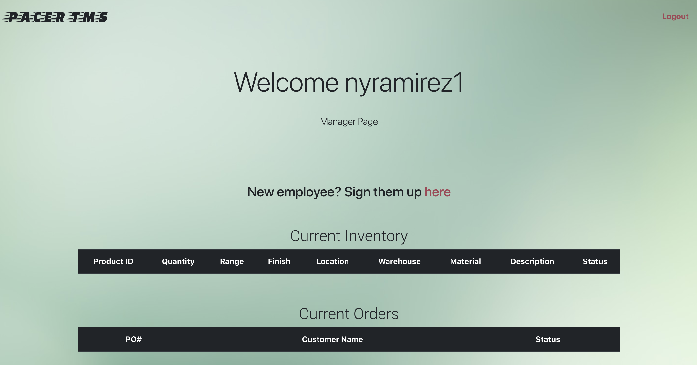
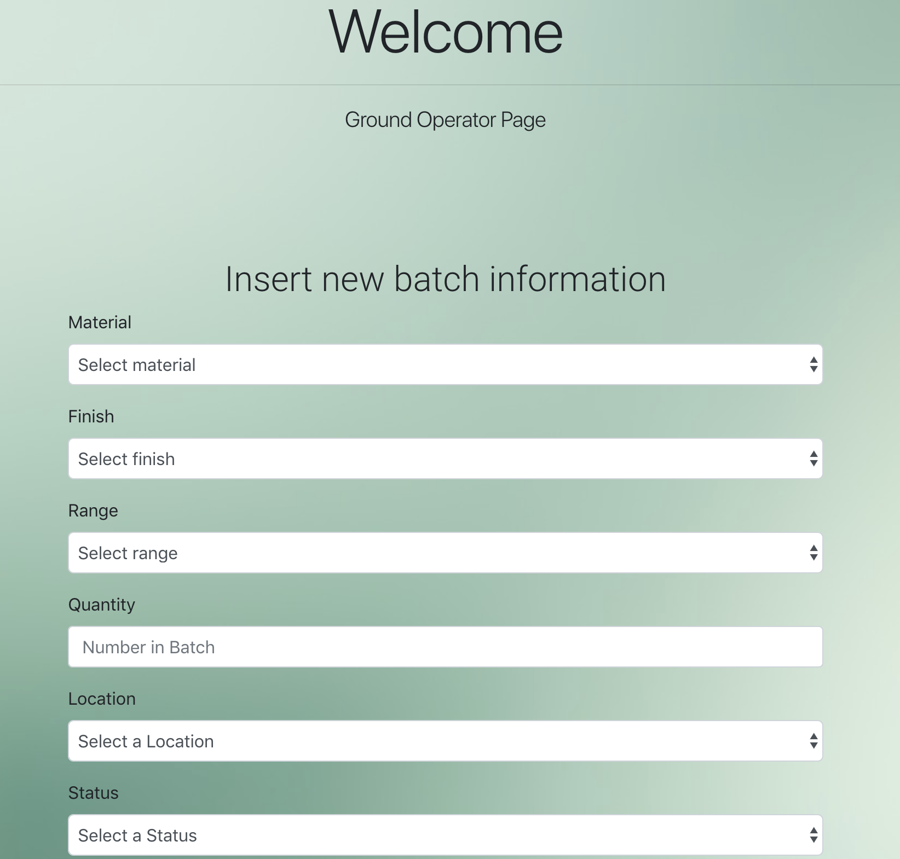
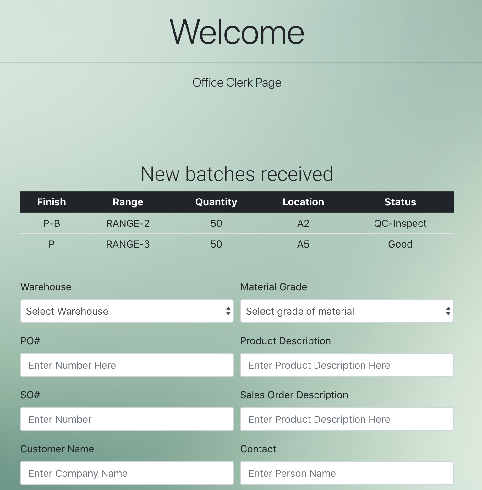
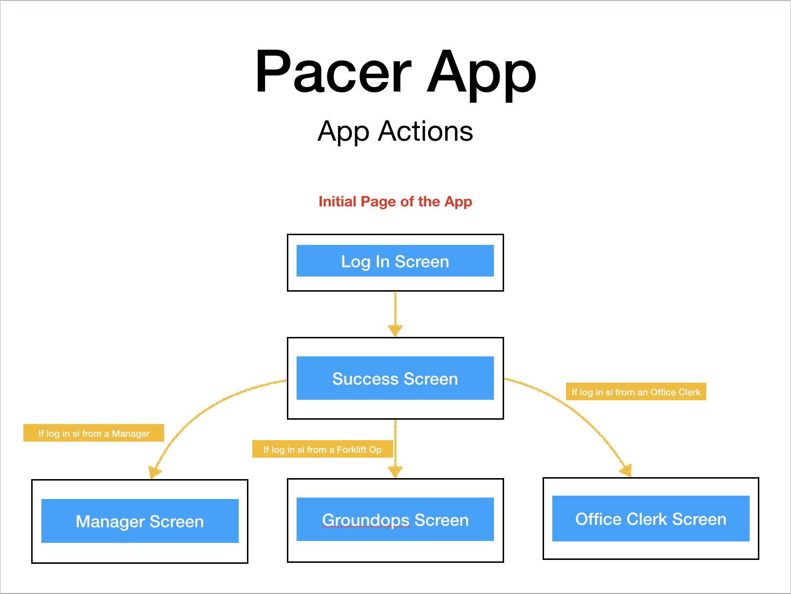
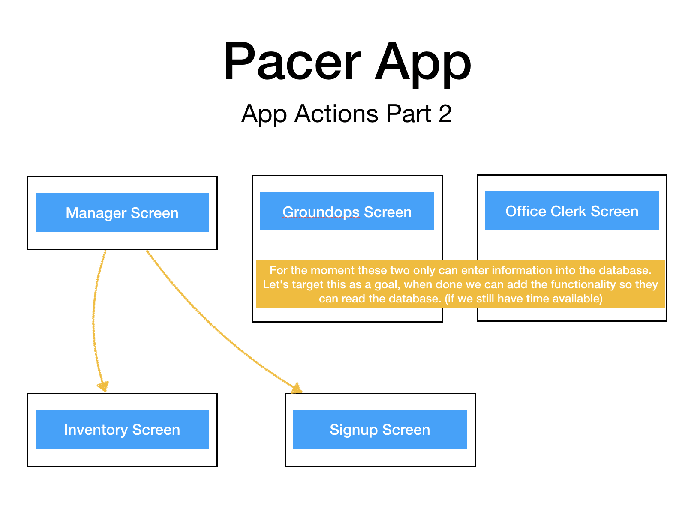
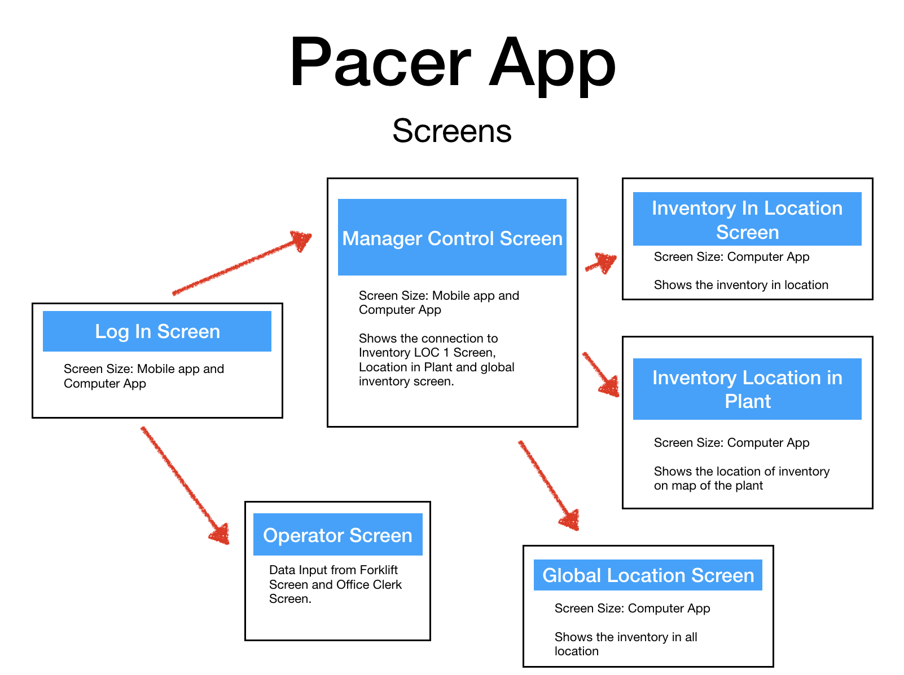
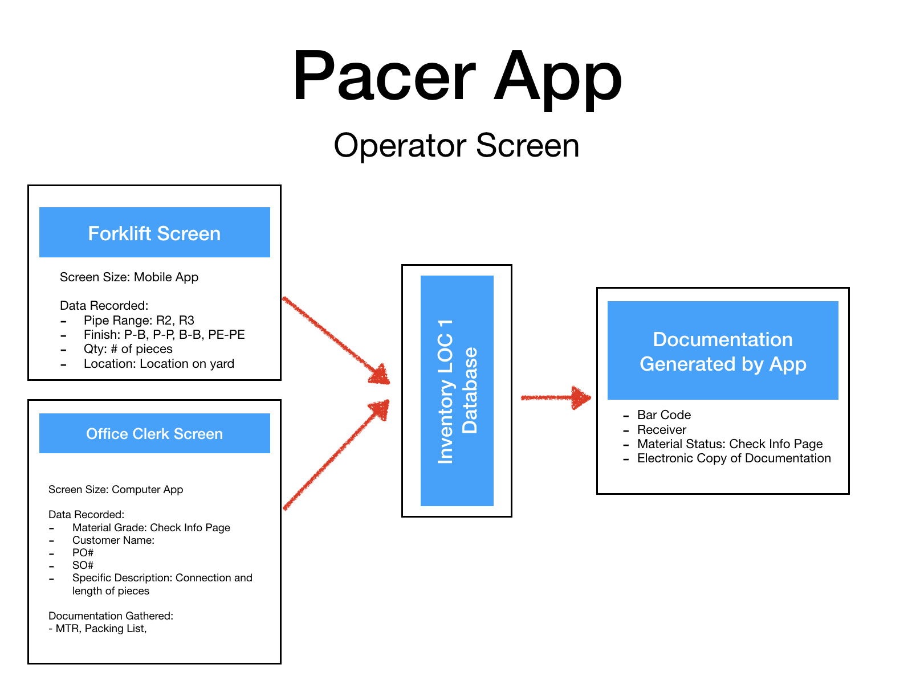

# Project2
## TMI TMS Group

## Pacer Transportation Management System.

### What is PACER TMS ?
*PACER* is an application that can manage complex inventory systems. Its capabilities range from simple material movemnets to detailed inventory control, with unique identifiers for each product. This version of the application was created from the perspective of pipe manufacturer, but application can be customized to fit any type of TMS need. 

### How it works ...
For *PACER* to work, access to the app has to be granted by the manager of the application. After an account is created,  the manager will be in charge of account assignment to each individual that needs access to *PACER*, with the access rights required that each individual needs. There are three types of accounts created so far on *PACER*: ground Operations, office clerk, and manager. 

* **Manager Account** - can create other accounts and view status of inventory.

* **Ground Operations** - can enter information into the database. This account is created to the operator that have direct contact with the material and can make viasual quality verification of material received or shipped.

* **Office Clerk** - can enter detailed information into the database. The diference between *Office Clerk* and *Forklift Accounts* is the information entered into the database. In the case of the Office Clerk, it is assumed a computer is available.

The initial screen for PACER is the loggin screen.

In order to access the app with this screen, an account has to be already in existance. If there is no account please contact your manager or HR representative.

**Depending on login credentils the app will route you to the screen that your account has acces granted.**

### Screen Flow after login
The next to pictures represent the flow between screens.

### Information Flow on Database
The next to pictures represent the flow of information from operators to database.

